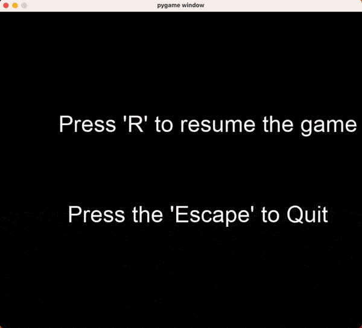

# tetris

Good old tetris game written in Python using Pygame.



## Getting Started

Install dependencies and setup environment

```sh
poetry install
```

Run tests

```sh
poetry run pytest
```

Run the application

```sh
poetry run python src/game.py
```
